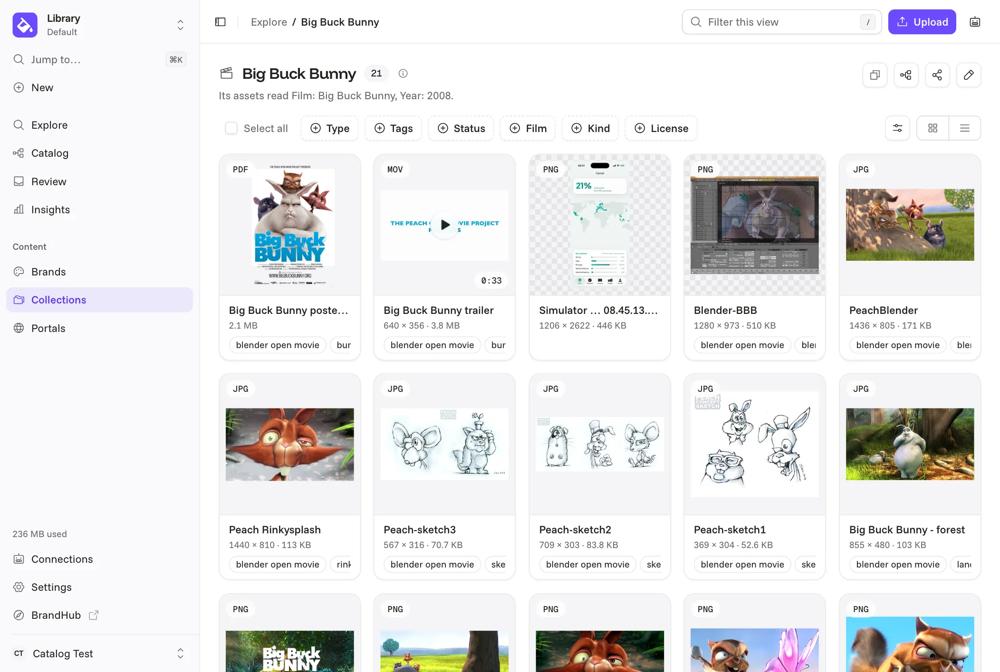

# Artbucket

[](https://github.com/pwnera/artbucket/actions/workflows/ci.yml)
[](LICENSE)
[](https://docs.artbucket.io/developers/stability)
[](https://docs.artbucket.io/developers/mcp)
[][Live brand page]


----

**Your brand's source of truth, open source.**

Which logo is current? What colors should an agent use? Is this photo cleared
for paid social in Germany?

Artbucket keeps a brand's assets, rules, rights and releases together, and
gives the same answer to people, AI agents and code. People read it in the web
app and on portals, agents query it over MCP, code consumes it through the API,
the CLI and Git.

**Web app · MCP · REST API · CLI · Git**

[Try Artbucket Cloud][Artbucket Cloud] · [Live brand page] · [Docs] · [Run it yourself](#run-it-yourself)

<p align="center">
  
</p>

----

## Your brand is an API

Find the asset, ask whether it may run, get it at the size you need:

```console
$ npx artbucket search primary logo
{id}  logo-primary.svg  #logo #primary

$ npx artbucket check {spring-hero} --channel paid-social --territory DE
refused  Spring hero
  x Replaced by Summer hero
  x License expired after 2026-03-12
  → Summer hero  https://assets.example.com/a/{summer-hero}  (Its replacement)

$ npx artbucket url {id} --width 1200 --format webp
https://assets.example.com/a/{id}/w_1200,f_webp
```

Agents make the same calls over MCP (`search_assets`, `check_use`,
`rendition_url`), and code over the [REST API] (`/api/v1`, with an OpenAPI
spec). The web app is a client of that API, with zero private endpoints, so
everything it does, you can script. See [May I use this?][check] and the [CLI].

## Connect an AI agent

`/api/v1/mcp` is an MCP server. Give the URL to any agent: it opens a consent
screen where you pick what it may do (Suggest, Read or Edit), and the agent
gets a key bound to you, never more than you can do.

```bash
claude mcp add --transport http artbucket https://app.artbucket.io/api/v1/mcp
```

That is [Artbucket Cloud]; on your own server, use its URL. Then ask: *"Give me
the approved logo for a dark background."* The agent checks the use and gets
the brand's dark-background variant, as a URL at the size it needs.

The Claude Code plugin adds a skill that teaches the workflow (brand rules
first, a use check before publishing, provenance on anything generated):
`/plugin marketplace add pwnera/artbucket`, then
`/plugin install artbucket@artbucket`. Other agents: `npx skills add pwnera/artbucket`.
See [MCP].

## Run it yourself

The whole core is here, free to self-host on Postgres and an S3-compatible
bucket. Nothing held back, nothing to unlock, no telemetry. You need Node 22+,
pnpm and Docker:

```bash
git clone https://github.com/pwnera/artbucket.git
cd artbucket
pnpm install
cp .env.example .env
docker compose up -d      # Postgres and S3-compatible storage
pnpm dev                  # migrates the database, then serves
```

Open http://localhost:3000 and make the first account: it is the admin of
everything. No Node on the machine? Set `BETTER_AUTH_SECRET` in `.env`
(`openssl rand -base64 32`) and run the published image with
`docker compose --profile app up -d`. The [quick start] takes it from there.

To put it on a server, follow the guide for [Render], [Docker Compose],
[Docker], [Fly], [Kubernetes], [Coolify] or a [plain VPS]. Any S3-compatible
storage works: AWS S3, Cloudflare R2, Backblaze B2, MinIO, Garage, SeaweedFS.

[](https://render.com/deploy?repo=https://github.com/pwnera/artbucket)

## What Artbucket manages

- **Assets: what exists.** The library: search in milliseconds at 100,000
  assets, and any size or format from one original as a URL,
  `/a/{id}/w_1200,f_webp`, with no export and no duplicate.
- **Rules: how to use it.** Colors, type, logo rules and don'ts as typed
  records with history, tied to the assets; guideline pages and design tokens
  are drawn from them.
- **Rights: where it may run.** License, channels, territories, embargo and
  last day of use on each asset. Ask before it runs: yes, or why not and what
  to use instead.
- **Releases: what is current.** Release the brand like software, pin a
  release, roll back. Portals and BrandHub show the release.
- **Access: who may use it.** Grants down to one asset, so an agency sees its
  slice. Single sign-on in every install, and viewers are never counted.
- **Portals.** A press kit, partner hub or retailer portal on your own domain,
  plus share and upload links for people without an account.
- **Review.** Uploads, tags and agent suggestions wait for a person's yes.
- **Provenance.** C2PA Content Credentials read on ingest and kept, IPTC/XMP
  written back into the file on download. Your files leave with their metadata.
- **Brand as code.** The brand as YAML in a Git repository, changed on either
  side and merged a rule at a time ([brand as code]).
- **Insights.** What gets used, by whom, on which release, counted without
  cookies.

## To start developing Artbucket

Read [CONTRIBUTING.md] first. Bug fixes go straight to a pull request; for
anything larger, open an issue before writing the code, since the roadmap is
opinionated on purpose. The load-bearing choices, and why, are in the
[decision records].

Built with Next.js, React, Postgres and Drizzle, sharp, better-auth and
Tailwind. No monorepo, no job queue, no Redis, no search cluster.

```bash
pnpm test
pnpm typecheck
pnpm lint
```

## Support

Start with the [documentation][docs.artbucket.io]. Questions and bugs go to
[GitHub issues], with the version you run, what you did and what you expected.
Security reports never go in a public issue: see [SECURITY.md].

## Roadmap

[ROADMAP.md] has what shipped, what is in progress and what is deferred on
purpose. Artbucket is at v1: `/api/v1` and the MCP tools are frozen, and what
works against them keeps working on every 1.x release ([stability]).

## License

[AGPL-3.0](LICENSE), copyright Pwnera SAS. Run it, change it, self-host it, for
any purpose. If you offer a changed version as a network service, publish your
changes. Building a product on Artbucket, or need your own terms? Pwnera SAS
also licenses it commercially: [open an issue][GitHub issues] and ask. `ee/` is
reserved for commercial code. See [decision 0013].

[Artbucket Cloud]: https://artbucket.io
[check]: https://docs.artbucket.io/guides/check
[brand as code]: https://docs.artbucket.io/guides/brand-as-code
[CLI]: https://docs.artbucket.io/developers/cli
[CONTRIBUTING.md]: CONTRIBUTING.md
[Coolify]: https://docs.artbucket.io/installation/coolify
[decision 0013]: docs/decisions/0013-agpl-and-cla.mdx
[decision records]: docs/decisions/index.mdx
[Docker Compose]: https://docs.artbucket.io/installation/docker-compose
[Docker]: https://docs.artbucket.io/installation/docker
[Docs]: https://docs.artbucket.io
[docs.artbucket.io]: https://docs.artbucket.io
[Fly]: https://docs.artbucket.io/installation/fly
[GitHub issues]: https://github.com/pwnera/artbucket/issues
[Kubernetes]: https://docs.artbucket.io/installation/kubernetes
[MCP]: https://docs.artbucket.io/developers/mcp
[plain VPS]: https://docs.artbucket.io/installation/vps
[quick start]: https://docs.artbucket.io/quickstart
[Render]: https://docs.artbucket.io/installation/render
[REST API]: https://docs.artbucket.io/developers/api
[Live brand page]: https://brand.artbucket.io/
[ROADMAP.md]: ROADMAP.md
[SECURITY.md]: SECURITY.md
[stability]: https://docs.artbucket.io/developers/stability
