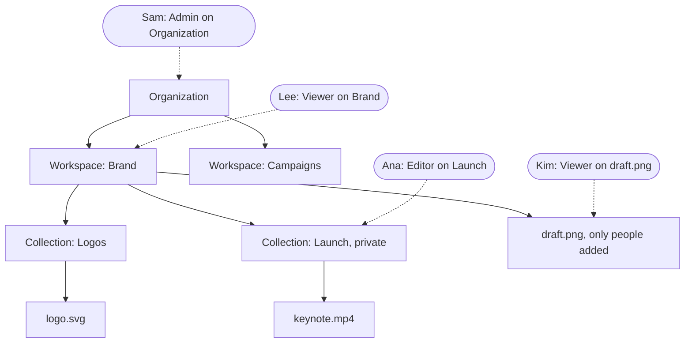
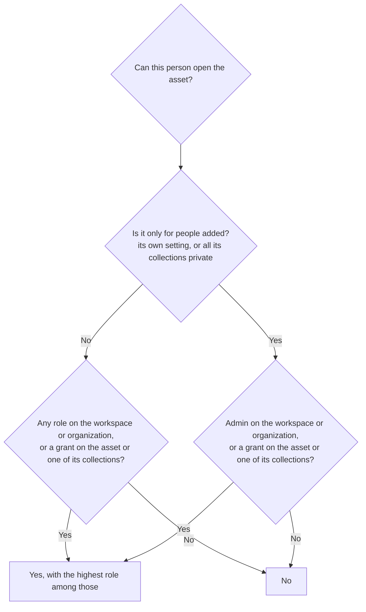

Two separate questions decide who reaches an asset:

- **Inside**: who on the team finds it in the library. Grants answer this, and
  **Who sees it** on an asset narrows it.
- **Outside**: who without an account gets it. Share links, signed URLs,
  **Embed** and portals answer this. Nothing goes outside unless someone
  with share on it sends it there.

The two don't mix: an asset only some people see can still have an embed URL,
and an asset everyone on the team sees is still closed to the rest of the
world.

## Inside: grants add up and reach down

A person's access is their **grants**: a role on the organization, a
workspace, a collection or one asset. A grant reaches everything below what
it is on, and grants add up: a person gets the highest role any of them gives.

Here:

| Person | logo.svg | keynote.mp4 | draft.png |
|---|---|---|---|
| Sam, admin on the organization | Admin | Admin | Admin |
| Lee, viewer on the Brand workspace | Viewer | No: Launch is private | No: only people added |
| Ana, editor on Launch | No | Editor | No |
| Kim, viewer on draft.png | No | No | Viewer |

### Roles

| Role | May |
|---|---|
| Viewer | Search, look, download |
| Contributor | Also upload and suggest tags and values; what they add waits for review |
| Editor | Also edit, approve, delete, and share links |
| Admin | Also manage people and API keys |

An editor's or admin's grant can switch abilities off: an editor who can't
delete, or can't share.

## Only people added

**Who sees it** on an asset, or **Private** on a collection, takes it out of
the workspace's reach. A role on the workspace no longer gets there; only
these do:

- a grant on the asset itself,
- a grant on one of its collections,
- admin on the workspace or the organization.

An asset whose collections are all private is hidden the same way, without
its own setting. One that is also in a collection that isn't private is seen
by the whole workspace.

An asset with its own **Who sees it** stays off portals and collection links,
whichever collection it is in: share it with a link to the asset itself.

Whoever hides something keeps reaching it: they get a grant on it at the role
they had. A workspace admin adds and removes people under **Who sees it** in
the asset's panel, or on Settings, People for a collection.

**Upload privately**, in the Upload menu, hides files from the moment they
land. A contributor's private upload waits in Review where only admins see it,
since editors aren't among the people added.

## Outside: links

Each of these takes share on the asset, and stops once it is archived,
expires or is replaced.

| Way out | Who gets it | For |
|---|---|---|
| **Team** link | Only people who already see it inside | Pointing a colleague at it |
| **Share link** | Anyone with the link, optionally with a password and an end date | Sending a few files to a partner |
| **Signed URL** | Anyone with the URL, for an hour to a year | A file for a tool or a one-off |
| **Embed** | Anyone with the URL, until turned off | A site, a doc, an email |
| **Portal** | The public, people with a password, or the workspace's people | A press kit, a partner hub |

See [sharing](/guides/sharing) and [portals](/guides/portals).

## Keys and agents

An API key works in one workspace with one role. A key a person connects is
capped at what that person can do there, and loses it when they do. Agents
usually get Contributor: what they add waits for a human
([decision 0005](/decisions/0005-agents-propose),
[decision 0006](/decisions/0006-grants-and-free-sso)).
